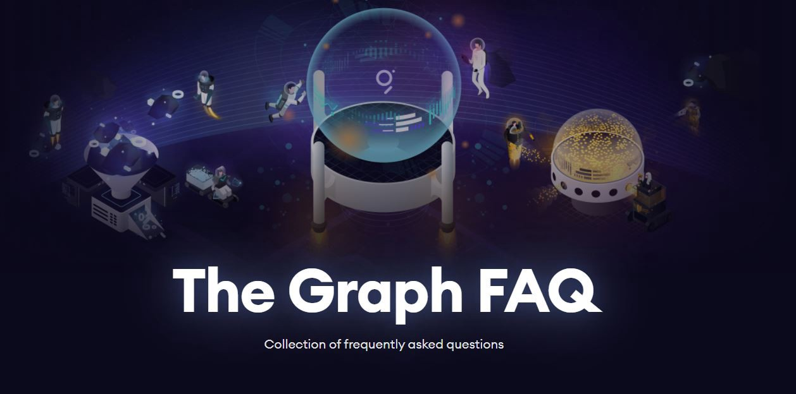

# FAQs

**This is an extensive list of frequently asked questions about The Graph ecosystem**. This community FAQ will be updated with the latest questions. Please be sure to check the [official documentation](https://thegraph.com/docs/) by The Graph team, the [Official Network FAQ](https://docs.google.com/document/d/1h48y_hQWb3CXbwHytsP3Hli1fNMqaMsiaoJd1x31HCQ/edit?usp=sharing) and this document before posting in the official channels. This helps the team to focus on the development of the Web3 protocol. Feel free to submit questions in the comment section, they will be answered and added to this article. _Please note that this is not an official FAQ by the team but all answers are confirmed from public responses by the team._

## Table of contents 

This FAQ is categorized into different topics to give you an easy overview. **Click on a link to jump to a particular section.**

1. **The Graph in general** General questions about the network. News and recent developments.
2. **Indexing** Questions about indexing on the network.
3. **Subgraphs** Everything related to subgraphs.
4. **Delegating / Staking** Frequently asked questions by delegators.
5. **Curating** Everything there is to know about curating.
6. **Grants** For those interested in applying for a grant.
7. **The Graph explorer**

   Questions about The Graph explorer.

8. **Miscellaneous**

   Other questions about The Graph that did not fit into a category.

### The Graph in general

Everything you need to know about The Graph ecosystem.

> What is The Graph?

The Graph is an indexing protocol for querying networks like Ethereum and IPFS. Anyone can build and publish open APIs, called subgraphs, making data easily accessible. In short, The Graph provides data that can be transformed, organized, and shared across applications for anyone to query with just a few keystrokes.

> Where can I learn more about The Graph?

To learn more about **The Graph Network**, you can read articles published on the [official blog](https://thegraph.com/blog/). You can find an overview of community-created guides and content about The Graph Network [here](https://www.notion.so/Community-Guides-abbb10f4dba040d5ba81648ca093e70c). For in-depth technical articles, have a look at the [official documentation](https://thegraph.com/docs/).

> How is The Graph protocol planning to cooperate with other blockchain platforms like Dfinity, Polkadot, Cosmos?

The Graph hosted service supports Ethereum, IPFS, and POA. Currently, The Graph Network supports Ethereum. This being said, The Graph is **blockchain agnostic** and we are here to unite the entire Web3 ecosystem. We have been speaking to all of the top Layer 1 blockchains, many of whom have offered us grants to integrate The Graph’s decentralized indexing layer on their blockchain. We plan to expand to other blockchains in the near future.

> Will there be an airdrop by The Graph?

Regarding airdrops, The Graph is one of very few projects that actually made people work for their tokens. The curator program was very intensive and people spent significant time learning about subgraphs, organizing data, and contributing to the network. This puts the team in an incredible position of having a well trained and incentivized community of builders dedication to growing Web3 on The Graph. At this point in time, there are no airdrops planned.

> Is there any way to get free GRT tokens?

[CoinMarketCap Earn](https://twitter.com/CoinMarketCap/status/1341310792461918210) and [Coinbase Earn](https://twitter.com/coinbase/status/1339723594566406156?s=20) are giving away free GRT tokens for participants that learn about the network and answer questions.

> What are competitors to The Graph network? And what sets it apart from other projects?

The main competitor is projects building indexing servers themselves and building their “dapps” on centralized infrastructure. What sets The Graph apart is that we enable high-performancae applications that are built completely on public infrastructure.

> What is the token distribution of The Graph? What about the 9B GRT supply? When and how are those tokens released?

You can find a full breakdown of the GRT token distribution in this [blog post](https://thegraph.com/blog/announcing-the-graphs-grt-sale).

> How much of the circulating supply is staked right now?

You can see the amount of GRT that is staked live on [network.thegraph.com](https://network.thegraph.com/)

> What is The Graph’s roadmap?

The team recently announced the creation of The Graph Foundation and the rebranding of the initial team into Edge & Node. The Graph Foundation is responsible for stewarding the protocol and Edge & Node will be providing development services to the foundation and generally building around the ecosystem. They’re going to be releasing a governance forum and other processes soon for community involvement in defining the roadmap for the protocol. Edge & Node will own its own roadmap and processes but we want there to be good formal processes and venues for ecosystem involvement so that it’s not one team dictating the roadmap and making protocol decisions.

> What’s the Github address of the graph?

You can find the Github here: [github.com/graphprotocol/](https://github.com/graphprotocol/)

> What do you focus on developing in Q1/2021?

The team’s focus for Q1 is getting things running stably on mainnet and on getting Graph Gateway ready for general availability. Graph Gateway will be operated by Edge & Node and will make it easy for developers to publish subgraphs to the network and pay for query fees with GRT. In addition they’ll be releasing a new decentralized Graph Explorer built on The Graph Network that allows people to browse subgraphs that have been signaled on by Curators. Graph Explorer will also have a Sandbox environment for developing subgraphs before publishing to the network. The goal with these upcoming product releases is to make it really easy for developers to get started building and going to production with subgraphs on the decentralized network.

> I am concerned about the token supply and the large increase of GRT tokens over time.

It took a team of roughly 15 people 3 years to build The Graph. The Graph was one of the first projects to sell a SAFT \(as opposed to equity\) because the team believes in decentralization. They have pre-sold tokens to fund that development and those initial backers took a tremendous amount of team risk, market risk, and technology risk during an uncertain period. Luckily the team found backers that are long term aligned and are active participants in the network and they’ve been incredibly helpful in getting us where we are today. The team is seeing strong demand for GRT but doesn’t have any privileged information and encourages people to do their own research on the state of the market.

> We can’t deny the fact that supporters want a project that has a real life use cases. Does Graph Protocol solve any problems or gaps in real life aspects? What are the important use cases that are worth highlighting?

The Graph solves a huge pain point for developers building applications in the Web3 ecosystem. The Graph is currently one of the most used protocols in the blockchain space today, behind Ethereum and IPFS, growing exponentially. A community of over 6k developers have built 3,400+ subgraphs, deploying them for applications like Aragon, Balancer, Synthetix, AAVE, Gnosis, Numerai, Livepeer, DAOstack, Uniswap, Mintbase, Gods Unchained, Decentraland, and many others. The Graph’s query volume has been growing at ~&gt;50% month over month.

Every time you use Uniswap.info, Synthetix exchange, AAVE, you are interacting with The Graph. The Graph is how each of these applications pulls information from the blockchain \(price, duration of time, etc\).

> How does The Graph produce its revenue?

The Graph is a decentralized protocol. The “revenue” earned in the network goes P2P to the Indexers, Delegators, and Curators in the ecosystem.

> Is there a danger of 51% attacks on the network?

51% attacks aren’t possible so this doesn’t actually pose a security threat to the network, but the team does recognize that it’s important for smaller Indexers to be able to make money and compete in the network.

> How can I join the team?

You can apply for a job [here](https://thegraph.com/jobs/marketing-and-communications-manager).

> What’s the schema used by The Graph?

The graph uses **GraphQL**, an open source query language developed by Facebook. Each element in the schema has a description. Learn GraphQL and you can then retrieve all the data that you want from the blockchain.

> What’s the GraphQL API?

**GraphQL** is a query language and server-side runtime for application programming interfaces \(**APIs**\) that prioritizes giving clients exactly the data they request and no more. **GraphQL** is designed to make **APIs** fast, flexible, and developer-friendly. **GraphQL API** is the API developers can use to access the indexed data by The Graph.

You can learn more about the GraphQL API in the [official documentation](https://thegraph.com/docs/graphql-api#queries).

> How do I buy The Graph token?

You can see all open markets on [CoinMarketCap](https://coinmarketcap.com/currencies/the-graph/markets/).

### Subgraphs 

Learn more about subgraphs.

> What is a subgraph?

Subgraphs are data structures to organize data that you pull from a blockchain. They are a way to define which data you want to get indexed and how to store it. Some of them do pre-aggregations or calculations on their mappings, some just store plain data similar to what you could find on-chain. Then, an entity queries that data. This entity could be a dapp \(company/developer, etc\), or could be a telegram bot, or a discord bot or even a simple user doing a query to find information.

> When are subgraphs launched? Which month? Are there plans?

You can expect to see the first subgraphs going into production on the network relatively soon. We expect the migration process for subgraphs to take at least 6 months. We’re building a brand new market that’s never existed so we want to take our time to make sure that the market is developing in a healthy way.

> Is there any chance I can run my own subgraph with a small amount of GRT tokens?

Sure! When signaling goes fully live on the network, it shouldn’t require too much GRT to get Indexers to start Indexing your subgraph. This will be a fun dynamic to see once the decentralized Graph Explorer is launched.

> What is the cost to query a subgraph?

Querying subgraphs from the hosted service is currently free to use for everyone. For the decentralized protocol, the team expects the query costs to be somewhere around $0.00001 per query, but it’s a free market, and every indexer can set its own cost models.

> Is there any incentive for creating subgraphs for a service I do not own?

There is! 10% of query fees go to the curation pool of the subgraph \(that is receiving those queries\). So actually building high value subgraphs has a native protocol incentive. Because you build it, then as deployed, you need to curate it so indexers start indexing it. That means, given it works with a bonding curve, that by being the first curating it \(as you know the value it provides cause you built it\), you get a bigger share of the curation pool of the subgraph you just deployed.

### Indexing 

Everything you need to know about indexing and indexers.

> How many GRT tokens do I need to become an indexer?

You need 100,000 GRT to become an indexer and the necessary infrastructure. It is the minimum amount you need to stake in order to register an indexer node on-chain

> What technical skills one would need to be a curator or indexer?

Indexers need extensive DevOps skills and the necessary hardware.

> How are rewards distributed? What is the current APY?

Rewards that come from the protocol inflation are first distributed proportional to the curation signal a subgraph has, then distributed proportional towards allocated stake on that subgraph. The current protocol inflation is set to 3% annual issuance. You can calculate the APY by looking at the number of allocated stake versus the total supply, knowing that the total supply is 10b GRT, and 3% annual inflation. _Note that your APY as a delegator depends on the indexer’s rewards cut. Indexers take part of your rewards as their cut, but some of them may also give some of their own rewards, in order to attract more delegators._

> How is malicious indexer behavior prevented?

Indexers are “punished” for changing delegation parameters by the market. All other things being equal, the team would expect Indexers who set lower cooldown periods to receive less delegation.

The team would also like to build tools that make it easier to spot Indexers that change delegation parameters erratically or too frequently. Some of these signals could be incorporated into a future version of the explorer.

> What benefit does an indexer receive for having more delegated stake?

More delegated stake means more total stake that is available to allocate towards indexing subgraphs, which in turn translates into more opportunities for earning indexer rewards and query fees.

If an Indexer is overdelegated, however, the excess delegated stake may not be used for allocations. Additionally, Consumers querying The Graph may choose to look at total delegated stake as one of the selecion criteria when choosing Indexers to send queries to.

> When can I change my indexer address?

You can’t change your indexer address in the next two years, starting December 2020.

### Delegating / Staking 

Everything you need to know about staking on The Graph.

> Are delegators subject to any risk of slashing if Indexers misbehave ?

Delegated tokens cannot be slashed. One thing to note is that Indexer tokens can be slashed if the Indexer acts maliciously on the network. Thus it is important to choose your indexer wisely because Delegator rewards are at risk if the Indexer you choose acts maliciously. There is also a small delegation tax paid upon delegating to an Indexer, which is really only worth paying if you expect to earn commissions from the Indexer.

> Where do we stake?

You can stake your GRT tokens on [network.thegraph.com](https://network.thegraph.com/) by delegating them to an indexer of your choice.

> How much does it cost me to delegate?

There is a 0.5% delegation tax that is incurred at the time of delegation to incentivize delegators to commit to an indexer

> How do I calculate my staking profit / delegator rewards?

Here is a [Delegation guide](https://thegraphportal.com/how-to-delegate/) made by the community. Here is a [Reward Calculator](http://reward.suntzu.me/) made by the community and [another community calculator](https://docs.google.com/spreadsheets/d/1VCbhgzhH_6X0qHBRt2xhzQXUH2YQaeFbSxrAaXWUWbM/edit#gid=0).

> Where do I see my delegation rewards?

You can see your delegation rewards by connecting your wallet on network.thegraph.com. Right now, the amount you have earned can be seen in the section **unrealized rewards**.

It is advisable to write down the amount of GRT you have delegated \(after deducting your delegation tax\) and to check back every now and then. If you want to see the amount of GRT you have earned so far, you can also use external tools like thegraph.live/delegators by pasting your ETH address into the search field.

> I haven’t received delegation rewards for a couple of days now. What is wrong?

Rewards are collected by the indexers, and distributed whenever their allocations are closed. That happens either manually, whenever the indexer wants to force close them, or automatically every maximum 28 epochs — max allocation lifetime \(right now, one epoch lasts for ~24h\).

> Why is there a 28 day thawing period?

The undelegating/thawing period is there to avoid certain economic attacks from taking place. It has to coincide with the max allocation lifetime of 28 epochs. Given how the rewards system currently works, a shorter undelegating period would potentially allow delegation to be “double-counted” across multiple simultaneous allocations.

> How do I choose an indexer?

Read this tutorial if you want to learn how to [choose profitable indexers](https://spacetraveller1.medium.com/choosing-profitable-indexers-graph-delegation-tutorial-ab14f764e597).

> Can I stake locked/vested GRT tokens?

Yes, you will be able to delegate locked rewards on The Graph Network! Wait for announcements in late January 2021.

> When we delegate our locked/vested tokens, will the rewards also be locked or it will be possible to withdraw them?

Rewards will be unlocked, but you need to have more than the initial value that you were rewarded in the vesting contract. Given the action of delegating has 0.5% tax, you need to recover that value and have a surplus \(which is the one you will be able to remove, after undelegating and waiting for the thawing period, of currently 28 days\).

> When is an indexer overdelegated and when will my rewards be diluted?

An indexer is overdelegated when the staked amount of GRT that the indexer owns his lower than the amount that is delegated to this indexer. Your delegation rewards will be diluted if this is the case.

> Are tokens earned from locked stakes also locked, or can they be withdrawn?

GRT earned is automatically staked but can be withdrawn. But first you must withdraw all stake, delegation and rewards into the token lock contract. The token lock contract, at any given time, is aware of how many tokens are locked, and any tokens directly held by the contract in excess of that amount are withdrawable. This obviously creates a lot of friction, because it implies going the unstaking and undelegating periods before withdrawing rewards.

While it wasn’t the team’s intent to create extra friction, the alternative would have been to make the token lock contract substantially more complex, or make a change at the protocol level specifically to address this concern. Both of these options would have put the network launch timeline at risk, given the tight availability of security auditors.

> How long does it take to undelegate my GRT tokens?

Undelegating takes 28 days because that is the maximum duration of an allocation. A shorter undelegating period would potentially allow delegation to be “double-counted” across multiple simultaneous allocations.

> Is there any way to see the balance and time left for thawing undelegated tokens?

In your profile dashboard, you’ll have dots \(purple for undelegating / green for when it’s ready to be withdrawn\). Furthermore, if you open the `undelegate` tab of the ones that are still undelegating, you'll see the timer there.

### Curating 

Frequently asked questions about curating.

> What are you expecting from the Curator community? And what new goals and rewards can we expect in the future?

We are grateful to everyone that participated in the Curator Program! It was a ton of fun and I think set a new standard for building community. Curators can continue building subgraphs and mapping out data for DeFi and Web3 in preparation for the full launch of curation on the network. You can also continue to make content \(memes, videos, guides, blogs, tweets, telegram messages, and more\) to grow your audience before Curation fully launches in the coming months. Additionally, Curators are able to delegate GRT tokens in the network now.

> How can I join the curator program?

The curator program has ended.

> How can I curate on The Graph?

Curating is not yet encouraged. Wait for official announcements from the team on the subject.

> Do we have an estimate when real subgraphs will be deployed and curating starts ?

The team plans on having more subgraphs and Curation live on the decentralized network by the end of Q1/2021.

> What technical skills one would need to be a curator?

To be a curator doesn’t take too much technical skill apart from the ability to judge whether or not the subgraph you’re curating is worth curating. Plus some code knowledge if you want to dig deeper.

### Grants 

Here’s everything you need to know about receiving a grant from The Graph.

> Where can I apply for a grant from The Graph?

You can apply via [Airtable.com](https://airtable.com/shreX09LazIhsg0bU).

> When will I be notified about my grant application?

After applying for a grant from The Graph you will receive a confirmation email. The application will be reviewed by the team. Once it has been reviewed, the team will get back to you about the decision on your submission and the next steps to follow.

> What is the deadline for the Q1 grants?

The deadline for the Q1 grants is January 15th 2021. The team has stated that they will do rolling applications so the application form will not be closed down.

What kind of ideas and suggestions can I submit for a grant?

You can apply for a grant if you have suggestions on how to improve the graph community and if you want to see more content, marketing, memes, videos. Other ideas include: tooling around subgraphs such as integration testing frameworks, GUI tools for generating subgraphs. The team could also use help on core protocol development and subgraph features like additional fulltext search implementations. They’re going to invest in open source community management this year to help organize these ideas but anything along those lines could be a great area for a grant.

> Who decides if I receive a grant?

The Graph Foundation will review grant applications.

**Eva Beylin** has been nominated to serve as Director of [The Graph Foundation](https://thegraph.com/blog/announcing-the-graph-foundation). The [Graph Council](https://thegraph.com/blog/inaugurating-council-and-grants) will oversee Grants and Ecosystem funding and decides if you receive a grant. The Council will be a 6-of-10 multisig with five stakeholder groups \(Indexers, Users, Researchers, Backers and Initial Team\).

> Can I add information to my submission for a grant?

You cannot edit your grand submission. The free to check if this becomes a feature in a later stage.

> Do I need to create example content when I apply for a grant?

Yes, this doing so is encouraged by the team. They suggest to make detailed plans and to set yourself KPIs. It's also encouraged to create an MVP.

### The Graph explorer 

> Will the Graph explorer include a real time tracker of total queries?

The Graph Explorer will show the query fees earned which are onchain. Each Gateway can see the query volume going through the gateway but that data isn’t onchain.

In the decentralized network queries only become “visible” when query fees are settled on-chain, and even then only in aggregate. Consumers and Gateways may choose to release real-time data from their own subjective views of the network. There’s no plans currently for incorporating this subjective data into the explorer, specifically because this would increase reliance on centralized APIs in the explorer. However, if the community is interested in, we could explore ways of getting more real-time data into the explorer.

### Miscellaneous 

> What is Edge and Node?

Edge and Node is the official Graph organisation. The team has decided to spin out into a separate entity \(Edge & Node\) that will continue providing services and will be involved with the protocol.

> What is The Graph Foundation?

From a legal and community standpoint The Graph Foundation will be a coordinating entity and we are going to be looking to elevate more external contributors to reduce single points of failure.

> I’ve sent x amount of GRT/ETH to the address in the pin message / to a moderator/admin. When will I receive my promised bonus?

Please be careful of replicated telegram groups and fake users that claim to be team members. The Graph team will never message you first or ask you to send GRT/ETH. They will never never run any bonus/airdrop campaigns.

