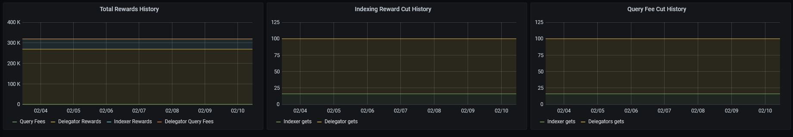
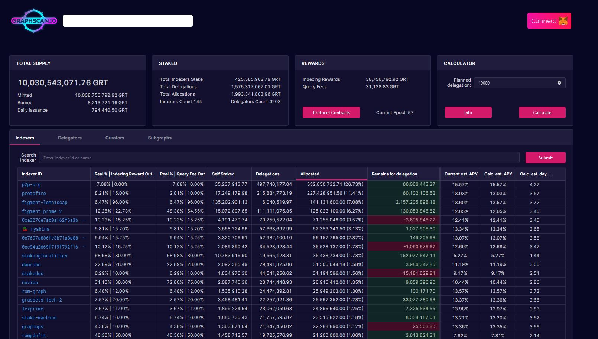
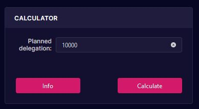
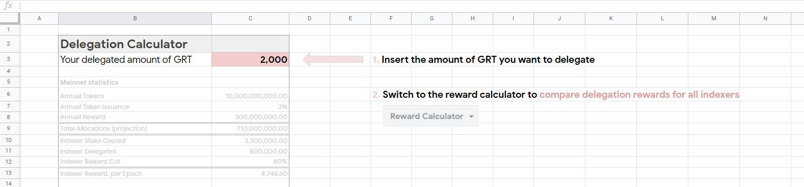

# Tools

Tools to evaluate Indexers and to compare their performance with each other.

## Stake-machine.com

[Thegraph.stake-machine.com](https://thegraph.stake-machine.com/d/-3BUUtbMz/thegraph-overview?orgId=1&refresh=5m) offers great analytics on the network but also on Indexers and Delegators.

### Historical changes of reward and fee cuts

A helpful feature of the website is that it allows Delegators to see if an Indexer has made changes to the reward and fee cut percentages.

It can also be used to see how often an Indexer closes allocations.

## Graphscan.io

[Graphscan.io](https://graphscan.io/) is another website for detailed statistics about Indexers, Curators and Delegators.

It can also be used to calculate estimated delegation rewards based on the amount of GRT you wish to delegate.

## Reward Calculators

### Indexer comparison and [reward calculator](https://docs.google.com/spreadsheets/d/1Zg39W_TJANNiYY-HrgAlrgolrTt7aFvVF1swzngjH5o/edit#gid=893976495) by Protofire.io



### Simplified reward calculator by me \(Space Traveler\)

The available calculators were lacking the functionality of comparing ndexers with each other. This is why [this simplified calculator](https://docs.google.com/spreadsheets/d/1NYSCxmJFgrX4YINyg5c-jBWBa4UR5aTTi5xhhjTIEuk/edit#gid=1291056551) was created.

All you need to do is insert the amount of GRT you want to delegate, the spreadsheet does the rest:

By switching to the reward calculator tab, You can now see an in-depth comparison of all the available indexers. The spreadsheet shows you if an indexer is overdelegated and how many days it will take you to break even \(because of the delegation tax of 0.5%\).

### Reward Calculator by SunTzu



## Other tools and resources







