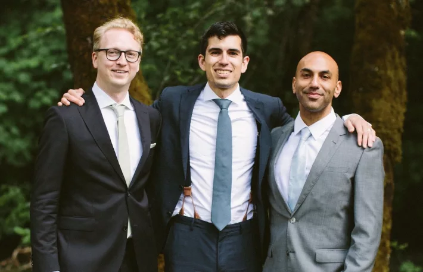

# Graph Protocol, Inc.

The Graph Protocol, Inc. changed its name to [Edge & Node](./). For forther information, see:


[.](./)


## Founding members of Graph Protocol, Inc.

Graph Protocol, Inc. was founded April 2018 by Jannis Pohlmann, Brandon Ramires and Yaniv Tal

* **Jannis Pohlmann**, Tech Lead & Co-Founder. [Linkedin.com](https://de.linkedin.com/in/jannispohlmann)
* **Brandon Ramirez**,  Research Lead & Co-Founder. [Linkedin.com](https://www.linkedin.com/in/1stramirez)
* **Yaniv Tal**, Project Lead & Co-Founder. [Linkedin.com](https://www.linkedin.com/in/yanivtal9)

## Current team members of Graph Protocol, Inc.

For documentation about current team members, see:


[.](./)


## Financials and Funding

According to [Crunchbase.com](https://www.crunchbase.com/organization/the-graph), The Graph has received a total of $19.5 million in funding from 15 investors during 7 funding rounds. Investors include Coinbase Ventures, AU21 Capital, Launch Code Capital, Digital Asset Capital Management, Framework Ventures and Multicoin Capital.
